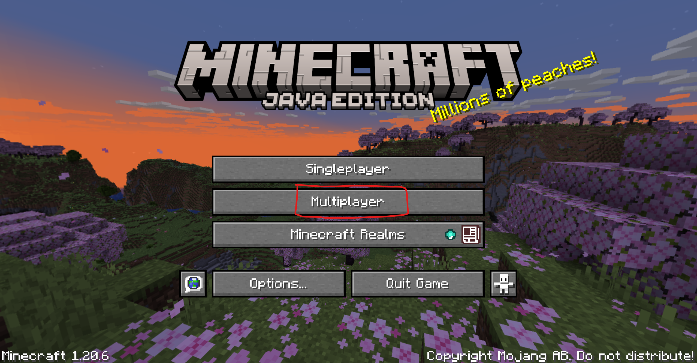
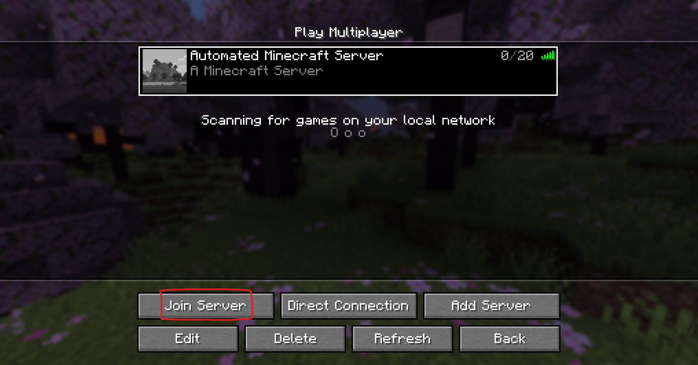

# Automated Minecraft Server Deployment on AWS

## Background
### What Will We Do?
- **Provision AWS infrastructure:** Using Terraform, we will create an EC2 instance, configure networking components like VPC and security groups, and ensure that all necessary AWS resources are correctly set up for running a Minecraft server.
- **Configure and manage the Minecraft server:** Once the infrastructure is ready, Docker Compose will be used to install the Minecraft server, configure its settings, and ensure it's ready for players to connect.

### How Will We Do It?
- **Using Terraform:** We'll write infrastructure-as-code scripts to define and deploy the cloud resources needed.
- **Using Docker and Docker Compose:** Docker will be utilized to containerize the Minecraft server, ensuring consistent environments and easy deployment through Docker Compose.


## Requirements
### Prerequisites
To successfully execute the scripts and deploy the Minecraft server, you will need:
- AWS Account
- Terraform installed on your machine ([Download Terraform](https://www.terraform.io/downloads.html))
- AWS CLI installed and configured ([AWS CLI Configuration](https://docs.aws.amazon.com/cli/latest/userguide/cli-configure-quickstart.html))

### Credentials and Configuration
- **AWS Credentials:** Ensure that your AWS credentials are configured properly by running `aws configure`. This will set up your access key, secret key, and default region.


## Major Steps
### Diagram of Your Major Steps


### Diagram of My Major Steps


## List of Commands to Run
What you'll need:
- Your AWS Access Key ID
- Your AWS Secret Access Key
- Your AWS Session Token

Where to go to find it:
1. Start your Learner Lab
2. Click `AWS Details`
3. Click `AWS CLI: Show`

```bash
# Fill in your AWS credentials in the placeholders
export AWS_ACCESS_KEY_ID=___
export AWS_SECRET_ACCESS_KEY=___
export AWS_SESSION_TOKEN=___

# Check that the main.tf file exists in the directory
ls

# Begin initialization of the Terraform project
terraform init

# Execute the Terraform plan to build the infrastructure
terraform apply

# Allow approximately 4 minutes for the EC2 instance to be created and configured

# Connect to your newly set-up Minecraft Server using the displayed IP address

# Refer to the final section of this README for connection instructions if needed

# To verify that the server restarts automatically, input the printed instance ID below and reboot the instance
aws ec2 reboot-instances --instance-ids i-___
```

## How to Connect to Minecraft Server

### Test the Server Using Nmap
```
nmap -sV -Pn -p T:25565 <instance_public_ip>
```

### Test the Server With Minecraft
1. Open the latest stable version of Minecraft
2. Click on multiplayer

3. Select __Add Server__

4. Create a name and under **Server Address**, enter the public IPv4 address of your server, then click **Done**.

5. Wait for Minecraft to connect to the server
6. Click on your server and then click **Join Server**

7. Enjoy your very own Minecraft server! Congratulations!!
